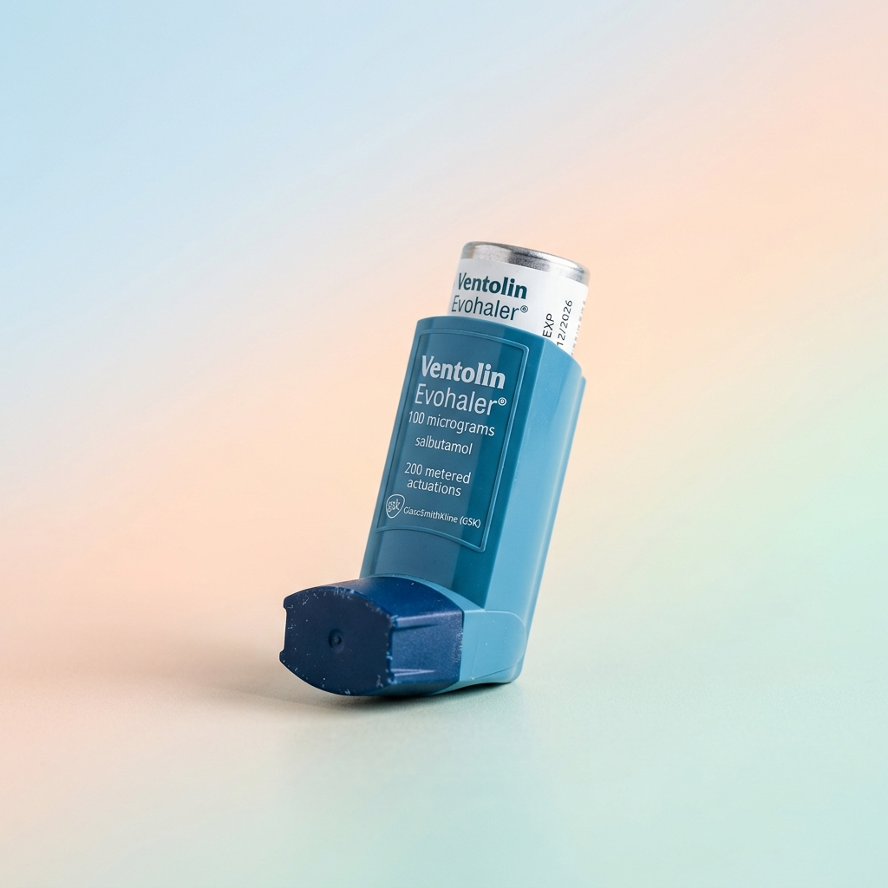
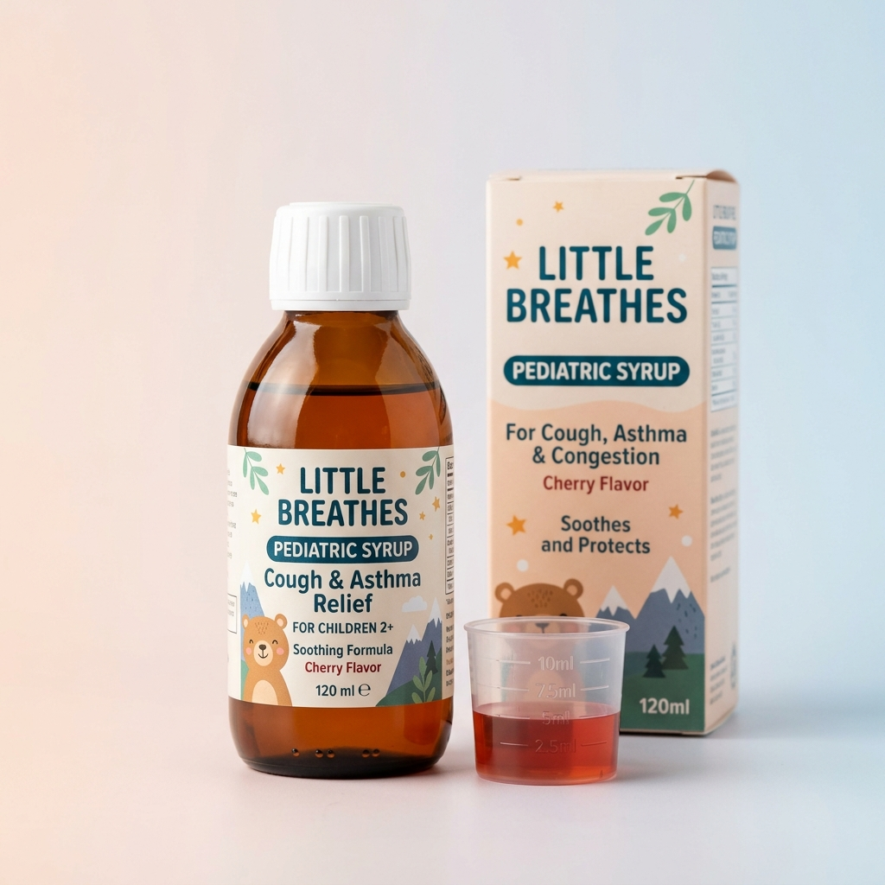

<div align="center">
  
  
  # 🫁 SAPARU (Sahabat Paru)
  ### *Smart Pediatric Respiratory Health Monitoring & AI Lung Screening Platform*

  [](https://expo.dev)
  [](https://reactnative.dev)
  [](https://nativewind.dev)
  [](https://www.typescriptlang.org/)
  [](https://github.com/pmndrs/zustand)
</div>

---

## 📖 Tentang SAPARU

**SAPARU** (Sahabat Paru) adalah platform kesehatan digital (*m-Health*) yang dirancang khusus untuk membantu orang tua memantau dan mendeteksi dini kesehatan saluran pernapasan anak (seperti asma, bronkitis, dan pneumonia). 

Aplikasi ini memadukan antarmuka ramah anak dengan teknologi kecerdasan buatan (*AI & Deep Learning*) untuk analisis akustik suara napas, pembacaan foto rontgen dada (*radiografi toraks*), rekomendasi dosis obat pediatrik, manajemen kepatuhan minum obat, reservasi dokter spesialis anak, serta navigasi fasilitas kesehatan terdekat (*Rute Bunda*).

---

## 🎨 Galeri Visual & Maskot

<div align="center">
  <table>
    <tr>
      <td align="center" width="25%">
        <br />
        <b>Axolotl Doctor & Inhaler</b>
      </td>
      <td align="center" width="25%">
        <br />
        <b>Acoustic Lung Detector</b>
      </td>
      <td align="center" width="25%">
        <br />
        <b>dr. Daffa, Sp.A</b>
      </td>
      <td align="center" width="25%">
        <br />
        <b>dr. Anna, Sp.A Subsp. Respi</b>
      </td>
    </tr>
  </table>
</div>

---

## 🌟 Fitur Utama

### 🎙️ 1. Deteksi Akustik Suara Paru (*Lung Sound Analyzer*)
<div align="center">
  
</div>

- **Perekaman Audio Real-time**: Menggunakan mikrofon perangkat untuk merekam suara napas dada anak dengan visualisasi gelombang dan efek partikel akustik dinamis (*React Native Reanimated*).
- **Klasifikasi Suara Paru**: Mengidentifikasi pola suara napas normal maupun abnormal seperti **Wheezing (Mengi)**, **Crackles (Ronki)**, dan **Stridor**.
- **Hasil & Riwayat Pemeriksaan**: Menyimpan hasil analisis ke dalam riwayat kesehatan anak untuk pemantauan berkelanjutan.

---

### 🩻 2. Pemindaian Rontgen Dada AI (*Chest X-Ray Scanner*)
- **Akuisisi Gambar**: Unggah atau foto langsung lembar film rontgen dada (*chest radiograph*) menggunakan kamera perangkat.
- **Deteksi Citra AI**: Menganalisis ada atau tidaknya infiltrat paru, konsolidasi, atau tanda infeksi saluran napas bawah.
- **Interpretasi Klinis Sederhana**: Menyajikan rangkuman hasil diagnostik yang mudah dimengerti orang tua beserta anjuran tindakan selanjutnya.

---

### 💊 3. Manajemen Jadwal Obat & Rekomendasi Dosis AI
<div align="center">
  <table>
    <tr>
      <td align="center" width="33%">
        <br />
        <b>Ventolin Inhaler</b><br />
        <sub>Salbutamol 100mcg</sub>
      </td>
      <td align="center" width="33%">
        <br />
        <b>Profilas Sirup</b><br />
        <sub>Ketotifen 1mg/5ml</sub>
      </td>
      <td align="center" width="33%">
        <br />
        <b>Salbutamol Tablet</b><br />
        <sub>Tablet 4mg</sub>
      </td>
    </tr>
  </table>
</div>

- **Generator Rekomendasi AI**: Menghitung rekomendasi takaran obat suportif berdasarkan usia anak, berat badan, dan gejala klinis yang dilaporkan.
- **Pelacakan Dosis & Kepatuhan**: Mendukung pencatatan jenis obat (inhaler, sirup, tablet) dan penandaan status *"Sudah Diminum"*.
- **Sistem Pengingat Ganda**:
  - *Device Notification*: Pengingat terjadwal melalui sistem notifikasi perangkat (`expo-notifications`).
  - *In-App Reminder Pop-up*: Modal interaktif yang otomatis muncul di layar saat jam minum obat tiba.

---

### 👨‍⚕️ 4. Reservasi Dokter Spesialis Anak
<div align="center">
  <table>
    <tr>
      <td align="center" width="25%">
        <br />
        <b>dr. Anna, Sp.A</b><br />
        <sub>RSUP Dr. Kariadi</sub>
      </td>
      <td align="center" width="25%">
        <br />
        <b>dr. Agung, Sp.A</b><br />
        <sub>RS Hermina Pandanaran</sub>
      </td>
      <td align="center" width="25%">
        <br />
        <b>dr. Adam, Sp.A</b><br />
        <sub>RS Telogorejo</sub>
      </td>
      <td align="center" width="25%">
        <br />
        <b>dr. Iwan, Sp.A</b><br />
        <sub>RS Columbia Asia</sub>
      </td>
    </tr>
  </table>
</div>

- **Direktori Dokter**: Menampilkan profil dokter spesialis anak dan konsultan respirologi, lokasi rumah sakit, serta jam praktik.
- **Pemesanan Jadwal**: Pemilihan slot waktu konsultasi (pagi, siang, malam).
- **Pop-up Konfirmasi Interaktif**: Konfirmasi reservasi dengan rincian jadwal dan aktivasi pengingat otomatis.

---

### 🗺️ 5. Rute Bunda & Direktori Fasilitas Kesehatan
<div align="center">
  
</div>

- **Peta Interaktif (GPS)**: Menampilkan rute terdekat menuju rumah sakit dan apotek mitra di sekitar pengguna.
- **Informasi Ketersediaan Obat**: Cek ketersediaan stok obat pernapasan pada apotek tujuan sebelum berangkat.
- **Integrasi Navigasi**: Tombol langsung untuk membuka rute di Google Maps.

---

### 📝 6. Profil Pediatrik & Kalkulasi Usia Otomatis
<div align="center">
  
</div>

- **Hitung Usia Otomatis**: Menghitung usia anak secara otomatis dan presisi ketika tanggal lahir (`HH/BB/TTTT`) dimasukkan.
- **Kuesioner Riwayat Kesehatan**: Pencatatan riwayat alergi, kondisi pernapasan keluarga, dan pemicu kekambuhan asma.

---

## 🏗️ Struktur Direktori Proyek

```plaintext
saparu/
├── assets/                     # Aset statis aplikasi
│   ├── images/                 # Gambar produk obat, latar visual, icon
│   └── mascot/                 # Karakter ilustrasi (Dokter, Inhaler, Detector, Apotik)
├── src/
│   ├── app/                    # File-based routing (Expo Router)
│   │   ├── _layout.tsx         # Root Layout, tema, splash, & modal pengingat global
│   │   ├── index.tsx           # Entry point pengarah autentikasi
│   │   ├── welcome.tsx         # Layar selamat datang
│   │   ├── login.tsx           # Layar masuk akun
│   │   ├── register.tsx        # Registrasi akun orang tua
│   │   ├── register-name.tsx   # Form nama & tanggal lahir (auto age calculation)
│   │   ├── pilih-gender.tsx    # Pemilihan jenis kelamin anak
│   │   ├── confirm-gender.tsx  # Konfirmasi jenis kelamin
│   │   ├── register-body.tsx   # Input tinggi & berat badan anak
│   │   ├── register-health.tsx # Kuesioner riwayat kesehatan pernapasan
│   │   ├── dashboard.tsx       # Beranda utama (status paru, menu cepat, reminder)
│   │   ├── scan-paru/          # Modul rekaman audio & analisis suara paru
│   │   ├── scan-roentgen/      # Modul analisis citra rontgen dada AI
│   │   ├── jadwal-obat.tsx     # Layar daftar jadwal minum obat
│   │   ├── tambah-obat.tsx     # Formulir penambahan jadwal obat
│   │   ├── rekomendasi-obat-ai.tsx # Generator rekomendasi dosis obat AI
│   │   ├── dokter-list.tsx     # Direktori daftar dokter spesialis anak
│   │   ├── konsultasi-dokter.tsx # Detail profil dokter & reservasi jadwal
│   │   ├── apotik.tsx          # Daftar apotek terdekat (GPS/Peta)
│   │   ├── apotik-detail.tsx   # Detail apotek & ketersediaan obat
│   │   ├── rumah-sakit-detail.tsx # Detail fasilitas rumah sakit rujukan
│   │   └── rute-bunda.tsx      # Peta navigasi rute ramah pernapasan
│   ├── components/             # Komponen UI Reusable
│   │   └── DueScheduleReminderModal.tsx # Pop-up modal pengingat jadwal minum obat
│   ├── lib/
│   │   └── axios.ts            # Konfigurasi instance Axios API client
│   ├── store/                  # Manajemen State Global (Zustand)
│   │   ├── useAuthStore.ts     # State autentikasi & sesi pengguna
│   │   ├── useDoctorStore.ts   # Data dokter & jadwal reservasi
│   │   ├── useMedicationStore.ts # Penyimpanan jadwal obat & sinkronisasi lokal
│   │   ├── useParuStore.ts     # Hasil perekaman & riwayat scan paru
│   │   ├── usePharmacyStore.ts # Data apotek & pemetaan gambar obat
│   │   ├── useRegistrationStore.ts # State form pendaftaran bertahap
│   │   └── useRoentgenStore.ts # Analisis gambar rontgen dada
│   └── utils/
│       ├── assetPreloader.ts   # Preload aset SVG/PNG saat inisialisasi aplikasi
│       └── notificationService.ts # Layanan notifikasi lokal & penjadwalan alarm
├── app.json                    # Konfigurasi proyek Expo & plugin native
├── eas.json                    # Konfigurasi build EAS (Preview, APK, Production)
├── global.css                  # Utilitas CSS Tailwind / NativeWind
├── tailwind.config.js          # Konfigurasi tema warna & font kustom
└── package.json                # Dependensi & skrip proyek
```

---

## 🛠️ Teknologi & Dependensi

| Kategori | Teknologi | Deskripsi |
| :--- | :--- | :--- |
| **Framework** | [Expo SDK 57](https://expo.dev/) | Platform React Native modern berbasis TypeScript |
| **Routing** | [Expo Router](https://docs.expo.dev/router/introduction/) | Navigasi deklaratif berbasis struktur file (*File-based routing*) |
| **Styling** | [NativeWind v5](https://nativewind.dev/) | Utilitas Tailwind CSS untuk styling React Native |
| **Animasi** | [React Native Reanimated](https://docs.swmansion.com/react-native-reanimated/) | Animasi performa tinggi untuk visualizer dan komponen interaktif |
| **State Management** | [Zustand](https://github.com/pmndrs/zustand) | Global state management yang reaktif dan ringan |
| **Keamanan Data** | [Expo SecureStore](https://docs.expo.dev/versions/latest/sdk/securestore/) | Penyimpanan data terenkripsi untuk token dan jadwal offline |
| **Audio & Media** | `expo-audio`, `expo-camera`, `expo-image` | Perekaman suara napas, kamera rontgen, dan rendering aset SVG |
| **Peta & Lokasi** | `react-native-maps`, `expo-location` | Pelacakan koordinat GPS dan rute fasilitas kesehatan |
| **Notifikasi** | `expo-notifications` | Pengingat waktu minum obat dan jadwal konsultasi |

---

## 🚀 Panduan Instalasi & Pengembangan

### 1. Prasyarat Sistem
- **Node.js**: v18.0.0 atau lebih baru
- **Bun** / **npm** / **yarn**
- **Expo Go** pada ponsel fisik atau Android Studio / Xcode Simulator

### 2. Kloning Repositori
```bash
git clone https://github.com/soraally1/saparu.git
cd saparu
```

### 3. Instalasi Dependensi
```bash
bun install
# atau
npm install
```

### 4. Konfigurasi Environment Variables
Buat file `.env` pada direktori utama proyek:
```env
EXPO_PUBLIC_API_URL=https://api.saparu.id/api/v1
EXPO_PUBLIC_SAPARU_API_KEY=your_groq_or_backend_api_key_here
```

### 5. Menjalankan Aplikasi
```bash
npx expo start
```
- Tekan `a` untuk membuka di Android Emulator.
- Tekan `i` untuk membuka di iOS Simulator.
- Buka aplikasi **Expo Go** di ponsel dan pindai QR Code di terminal.

---

## 📦 Panduan Build Aplikasi (EAS Build)

Untuk membuat file instalasi APK (*Standalone Android Build*):

```bash
# 1. Pastikan EAS CLI terpasang
npm install -g eas-cli

# 2. Login ke akun Expo
eas login

# 3. Jalankan Build APK (Profil Preview)
eas build --profile preview --platform android
```

---

## 🎨 Tipografi & Desain
- **Tipografi**: `Fuzzy Bubbles` (`FuzzyBubbles_400Regular`, `FuzzyBubbles_700Bold`)
- **Palet Warna**:
  - `Mint Green (#8DC5B8 / #9BCEC1)` : Warna utama kesehatan paru & latar layar
  - `Pastel Pink (#FDE3E7 / #FFAE9D)` : Warna kartu aksen, tombol sekunder, dan efek
  - `Sky Blue (#6CA8C2)` : Elemen medis, badge, dan navigasi
  - `Soft Coral (#F0A080)` : Tombol aksi utama & pengingat harian

---

<div align="center">
  <br />
  <sub>Dibuat dengan ❤️ untuk pemantauan kesehatan pernapasan anak-anak Indonesia.</sub>
</div>
